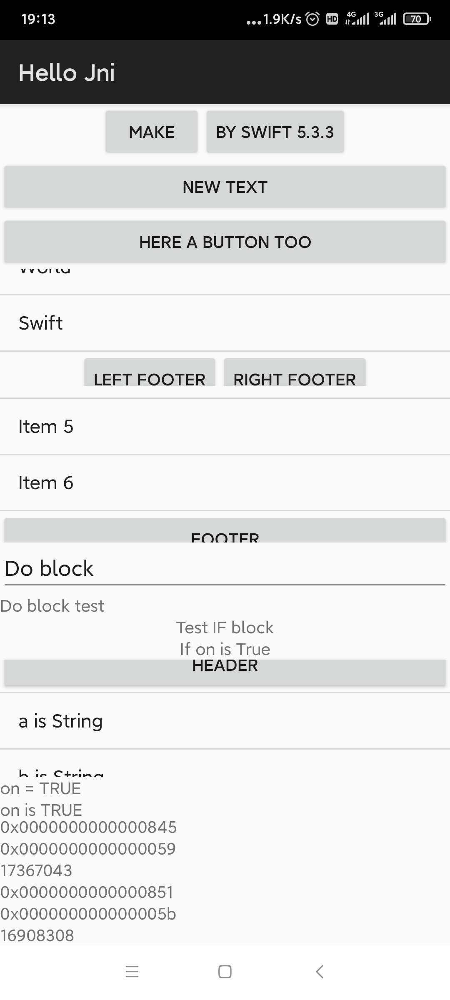

# test swift ui for android

A description of this package.

~~~swift
struct TContentView: View {
  @State var on: Bool = true
  let data = ["a", "b", "c", "d", "e", "f", "g"]
  public var obj: Object { body.obj }
  public var body: some View {
    LinearLayout(orientation: .VERTICAL) {
      LinearLayout {
        Button("Make")
        Button("by swift 5.3.3")
      }.with(gravity: .CENTER_HORIZONTAL)
      Button("Here a button").with(text: "New Text")
      Button(
        "Here a button too",
        click: { o, v in
          if v is Button {
            logging(type: "Swift", message: "hello world")
            (v as! Button).setText(obj: o, text: "Clicked")
          }
        },
        long: { o, v in
          if v is Button {
            logging(type: "Swift", message: "long click world")
            (v as! Button).setText(obj: o, text: "long Clicked")
          }
          return 1
        })
      List {
        Button("Header")
        [
          "Hello",
          "World",
          "Swift",
        ]
        LinearLayout {
          Button("left Footer")
          Button("right Footer")
        }.with(gravity: .CENTER_HORIZONTAL)
      }.with(weight: 0.75)
      List(0...6, footer: Button("Footer")) { id in
        "Item \(id)"
      }.with(weight: 1.0)
      do {
        EditText("Do block")
        TextView("Do block test")
      }
      if on {
        TextView("Test IF block").with(gravity: .CENTER_HORIZONTAL)
        TextView("If on is True").with(gravity: .CENTER_HORIZONTAL)
      }
      List(data, header: Button("Header"), footer: Button("Footer")) { id in
        "\(id) is String"
      }.with(weight: 0.75)
      if on {
        TextView("on = TRUE")
        TextView("on is TRUE")
      } else {
        TextView("on = False")
        TextView("on is False")
      }
      ScrollView {
        TextView(Context.debug())
      }.with(fillViewport: true).with(weight: 0.8)
    }
  }
}
~~~

